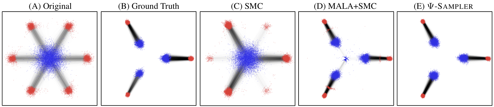

<h1 align="center">Ψ-Sampler</h1>
<div align="center">
  
## Initial Particle Sampling for SMC-Based Inference-Time Reward Alignment in Score-Based Generative Models

</div>




<p align="center">
  <a href="https://arxiv.org/abs/2506.01320">
    
  </a>
  <a href="https://psi-sampler.github.io/">
    
  </a>
</p>
<!-- Authors -->
<p align="center">
  <a href="https://github.com/taehoon-yoon">Taehoon Yoon*</a>,
  <a href="https://cactus-save-5ac.notion.site/4020147bcaef4257888b08b0a4ef238d">Yunhong Min*</a>,
  <a href="https://32v.github.io/">Kyeongmin Yeo*</a>,
  <a href="https://mhsung.github.io">Minhyuk Sung</a>
  (* equal contribution)
</p>

## Introduction
We propose **Ψ-Sampler**, an SMC-based framework that improves inference-time reward alignment in score-based generative models via efficient posterior initialization using the pCNL algorithm.

[//]: # (### Abstract)
> We introduce Ψ-Sampler, an SMC-based framework incorporating pCNL-based initial particle sampling for effective inference-time reward alignment with a score-based generative model. Inference-time reward alignment with score-based generative models has recently gained significant traction, following a broader paradigm shift from pre-training to post-training optimization. At the core of this trend is the application of Sequential Monte Carlo (SMC) to the denoising process. However, existing methods typically initialize particles from the Gaussian prior, which inadequately captures reward-relevant regions and results in reduced sampling efficiency. We demonstrate that initializing from the reward-aware posterior significantly improves alignment performance. To enable posterior sampling in high-dimensional latent spaces, we introduce the preconditioned Crank–Nicolson Langevin (pCNL) algorithm, which combines dimension-robust proposals with gradient-informed dynamics. This approach enables efficient and scalable posterior sampling and consistently improves performance across various reward alignment tasks, including layout-to-image generation, quantity-aware generation, and aesthetic-preference generation, as demonstrated in our experiments.

## Release
Code will be released soon.

##  Citation
```
@misc{yoon2025psisamplerinitialparticlesampling,
      title={$\Psi$-Sampler: Initial Particle Sampling for SMC-Based Inference-Time Reward Alignment in Score Models}, 
      author={Taehoon Yoon and Yunhong Min and Kyeongmin Yeo and Minhyuk Sung},
      year={2025},
      eprint={2506.01320},
      archivePrefix={arXiv},
      primaryClass={cs.LG},
      url={https://arxiv.org/abs/2506.01320}, 
}
```
